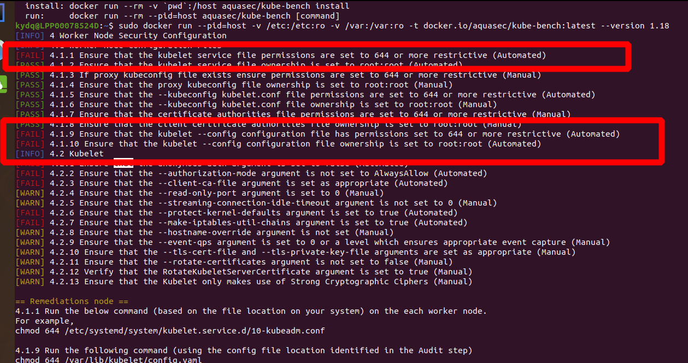
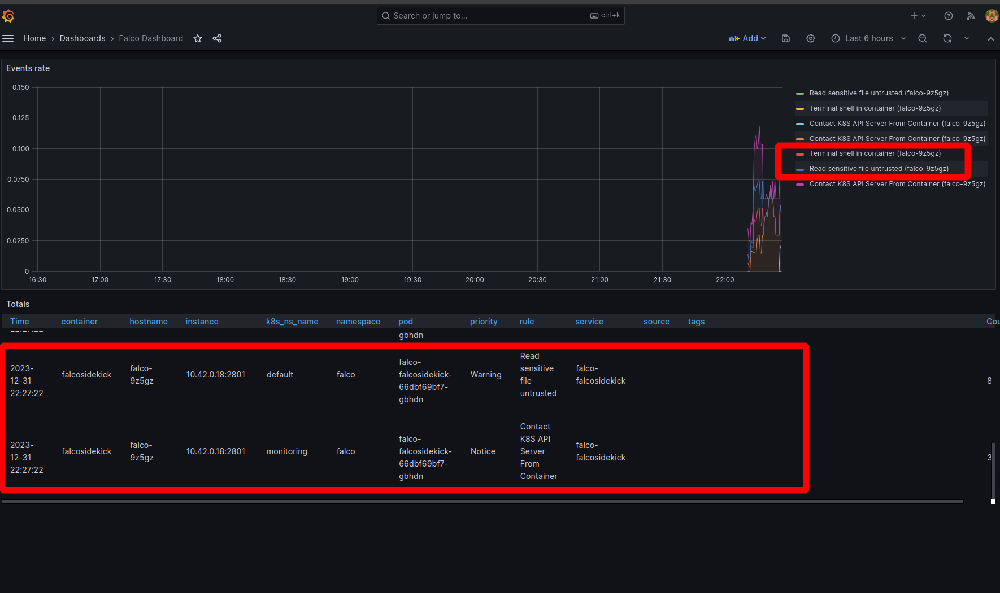

# Prerequisites
```shell

# Update git
sudo add-apt-repository -y ppa:git-core/ppa

sudo apt-get update

sudo apt-get install git -y

git --version

# Docker version
sudo docker --version

# Python version
python --version

```

# Docker bench
```shell

git clone https://github.com/docker/docker-bench-security.git

cd docker-bench-security

sudo ./docker-bench-security.sh

```


## Kube hardened
```shell
# [WARN] 2.15 - Ensure live restore is enabled (Scored)
# [WARN] 2.16 - Ensure Userland Proxy is Disabled (Scored)
# [WARN] 2.14 - Ensure containers are restricted from acquiring new privileges (Scored)

cat /etc/docker/daemon.json

{
    "live-restore": true, 
    "userland-proxy": false, 
    "no-new-privileges": true 
}

```


# Kube bench
```shell

git clone https://github.com/aquasecurity/kube-bench.git

cd kube-bench/

kubectl apply -f job.yaml

kubectl get pods
NAME               READY   STATUS      RESTARTS   AGE
kube-bench-4cmrp   0/1     Completed   0          14h

kubectl logs kube-bench-4cmrp

```


## Kube hardening

https://docs.k3s.io/security/hardening-guide

### Pod Security

```shell
sudo cat /var/lib/rancher/k3s/server/psa.yaml
apiVersion: apiserver.config.k8s.io/v1
kind: AdmissionConfiguration
plugins:
- name: PodSecurity
  configuration:
    apiVersion: pod-security.admission.config.k8s.io/v1beta1
    kind: PodSecurityConfiguration
    defaults:
      enforce: "restricted"
      enforce-version: "latest"
      audit: "restricted"
      audit-version: "latest"
      warn: "restricted"
      warn-version: "latest"
    exemptions:
      usernames: []
      runtimeClasses: []
      namespaces: [kube-system, cis-operator-system]
```

### NetworkPolicies
- The Backend (BE) namespace is configured to only allow incoming network access from the Frontend (FE) namespace specifically on ports 80 and 443.

- The Database (DB) namespace enforces a more granular access control policy by permitting inbound network traffic solely from the Backend (BE) namespace.

```shell
# allow-fe-to-be.yaml
apiVersion: networking.k8s.io/v1
kind: NetworkPolicy
metadata:
  name: allow-fe-to-be
  namespace: be
spec:
  podSelector:
    matchLabels:
      app: backend
  ingress:
  - from:
    - namespaceSelector:
        matchLabels:
          name: fe
  ports:
  - protocol: TCP
    port: 80
# allow-be-to-db.yaml
apiVersion: networking.k8s.io/v1
kind: NetworkPolicy
metadata:
  name: allow-be-to-db
  namespace: db
spec:
  podSelector:
    matchLabels:
      app: database
  ingress:
  - from:
    - namespaceSelector:
        matchLabels:
          name: be


```
### API Server audit configuration
```shell
sudo ls -la /var/lib/rancher/k3s/server/logs
udo tail /var/lib/rancher/k3s/server/logs/audit.log
{"kind":"Event","apiVersion":"audit.k8s.io/v1","level":"Metadata","auditID":"63b66702-c5ce-48b4-a6e3-d4359cc0bfcc","stage":"ResponseStarted","requestURI":"/apis/storage.k8s.io/v1/csidrivers?

```


# Grype, Harden and Deploy the Flask App

https://github.com/anchore/grype

```shell

curl -sSfL https://raw.githubusercontent.com/anchore/grype/main/install.sh | sudo sh -s -- -b /usr/local/bin

sudo grype vuln_app-sqli

```


## Hardened


# Falco
```shell

helm repo add falcosecurity https://falcosecurity.github.io/charts
helm repo update

kubectl create namespace falco

# helm install 
helm install falco falcosecurity/falco -n falco --set driver.kind=modern-bpf --set tty=true --set collectors.containerd.enabled=true --set collectors.containerd.socket=/run/k3s/containerd/containerd.sock --set falcosidekick.enabled=true --set auditLog.enabled=true --set serviceMonitor.enabled=true


kubectl get events --sort-by=.metadata.creationTimestamp -n falco

kubectl get pods,svc -n falco
NAME              READY   STATUS    RESTARTS   AGE
pod/falco-nnxqx   2/2     Running   0          8m14s

# Simuate
kubectl exec -it alpine -- sh -c "ls -la"

kubectl logs -l app.kubernetes.io/name=falco -n falco -c falco | grep Notice

```


## Configure the Prometheus Operator and Grafana.
```shell
#  Install Prometheus Operator
helm repo add prometheus-community https://prometheus-community.github.io/helm-charts
helm repo update

kubectl create namespace monitoring

helm install prometheus-operator prometheus-community/kube-prometheus-stack -n monitoring

kubectl get pods,svc -n monitoring

# Install Grafana
helm install grafana prometheus-community/grafana -n monitoring
kubectl port-forward service/grafana -n monitoring 3000:80

kubectl get pods,svc -n monitoring

# ServiceMonitor
kubectl apply -f deployment/falco-falcosidekick-monitor.yaml 
```

